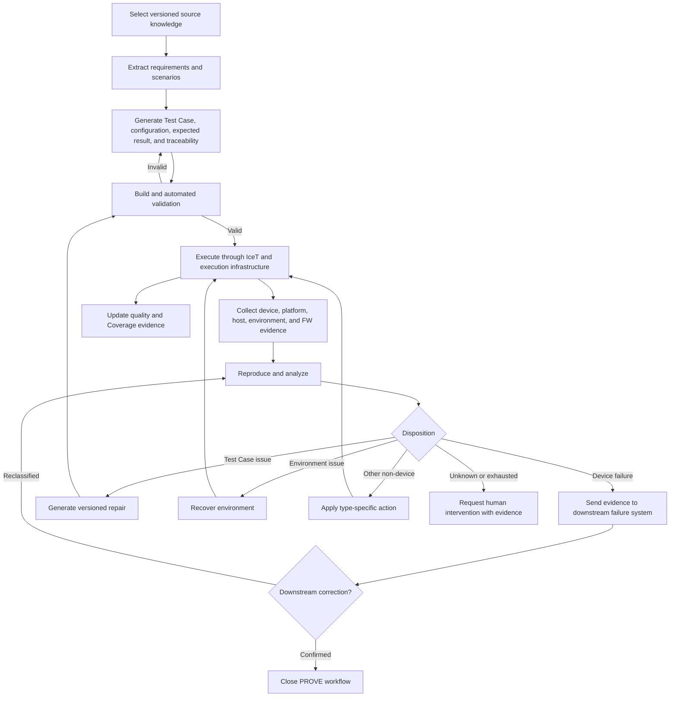

# Target Workflow

# Loop Exit Conditions

- Pass
- Device failure transferred with evidence
- Repair or recovery limit exceeded
- Unknown disposition requiring a person
- Policy-mandated stop

# Framework Independence

LangGraph is an example, not a mandated framework. Workflow contracts must remain independent of a specific agent-orchestration product.

# Execution Topology

Engineering development should use systems compatible with the SkyTower execution model. Local and Mass environments should share workflow and execution contracts rather than becoming separate products.
