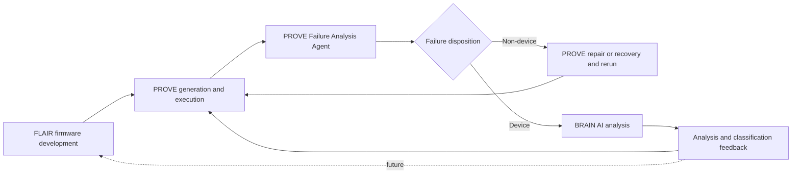

# Responsibilities

- **FLAIR**: AI Agent and Vibe Coding-based SSD firmware development.
- **PROVE**: Requirement and Scenario extraction, Test generation and execution, official Pass/Fail decision, and device/non-device Failure disposition.
- **BRAIN**: AI Agent-based detailed analysis of SSD firmware failures.

Within PROVE, a Test Fail triggers the PROVE Failure Analysis Agent. This Agent determines Device, Non-device, or Unknown Disposition. It is distinct from BRAIN, which receives a Device Failure after that PROVE decision.

# Failure Flow

# Automation Position

In the current target, a PROVE device-failure disposition is handed to BRAIN automatically without human approval, and BRAIN Agents begin analysis automatically.

PROVE does not need to prove the internal SSD root cause before this handoff. A defined Device-behavior violation supported by direct Evidence or reasonable exclusion of Non-device causes is sufficient under the future approved Evidence policy.

If BRAIN reclassifies the Failure as non-device, the result returns to PROVE for reanalysis and improvement.

# Long-Term Closed Loop

The desired future loop sends BRAIN root-cause analysis to FLAIR, lets FLAIR modify firmware, and invokes PROVE for regeneration or regression execution until an exit condition is reached. This complete loop is a target, but not part of the committed first two-month outcome.

# Open Contracts

FLAIR development-context schema, PROVE-to-BRAIN handoff schema, BRAIN feedback schema, loop limits, and final authority remain to be defined.
