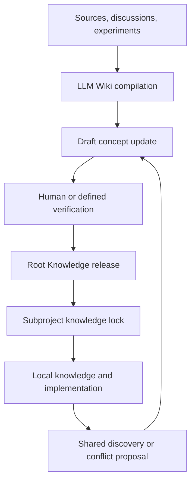

# Model

PROVE uses a federated knowledge model:

- This Root repository owns shared purpose, terminology, principles, capability boundaries, metrics, and interfaces.
- Every subproject has an independent Git repository and its own `docs/` OKF bundle.
- Subprojects pin the Root version used for their decisions.
- Shared discoveries flow upstream through review; Root releases flow downstream through explicit upgrades.

# Knowledge Flow

# Source-of-Truth Rule

Root content must not be manually copied into subproject documentation. A subproject records the Root repository, release, and commit in `prove-knowledge.lock`. A fetched or generated cache is allowed, but it is not authoritative.

# LLM Wiki Rule

Agents should update existing concepts, connect related concepts, expose contradictions, preserve sources, and append meaningful changes to `log.md`. They must not convert an unresolved question into a fact.

# OKF Rule

- Bundle version: OKF v0.2
- Every non-reserved Markdown concept has YAML frontmatter and `type`.
- `index.md` and `log.md` follow reserved-file rules.
- `generated` identifies the current producer.
- `verified` is added only after actual verification.
- `status` uses `draft`, `stable`, or `deprecated`.

# Release Rule

Root releases use semantic versions. A subproject upgrade must review affected terminology, principles, interfaces, and decisions before changing its lock.
