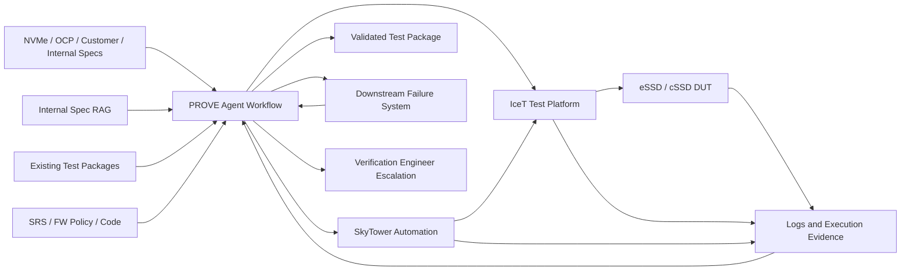

# Context

# Inputs

- Official NVMe specifications
- OCP specifications
- Customer specifications
- Internal requirements and verification knowledge
- Existing test packages
- SRS, firmware policy, generated code, and code changes
- Historical SkyTower execution and failure data

# Outputs

- Requirements and Test Scenarios
- Executable Test Cases and configurations
- Expected results and traceability
- Coverage and quality evidence
- Execution records
- Device/non-device/unknown dispositions
- Reproduction and analysis reports
- Validated package changes
- Human intervention requests

# Unresolved Interfaces

Detailed SkyTower structure, downstream failure-system API, Spec RAG mutation rights, and repository boundaries remain open.
