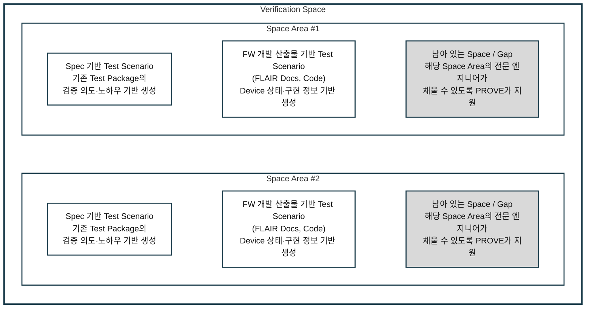
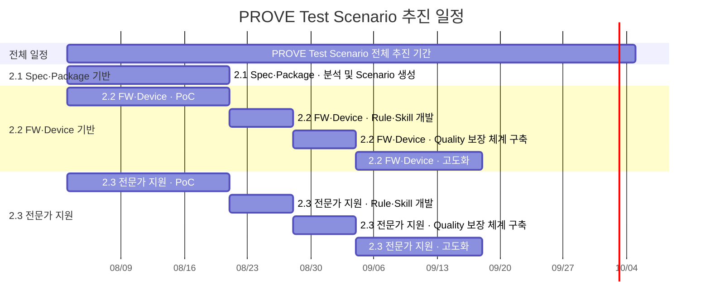

# PROVE 원리와 Firenze 적용 방향

## 목차

- [1. PROVE의 목표와 점진적 추진 방향](#1-prove의-목표와-점진적-추진-방향)
- [2. PROVE는 어떻게 Test Scenario를 생성할 것인가](#2-prove는-어떻게-test-scenario를-생성할-것인가)
- [3. PROVE가 생성한 결과의 Quality 보장](#3-prove가-생성한-결과의-quality-보장)
- [4. PROVE의 Input](#4-prove의-input)
- [5. Firenze 적용 방안 및 기존 Spec 대비 Incremental 관리](#5-firenze-적용-방안-및-기존-spec-대비-incremental-관리)
- [6. 일정](#6-일정)

## 1. PROVE의 목표와 점진적 추진 방향

PROVE의 목표와 현재 수준을 `무엇을 얼마나 검증할 것인가(Coverage 관점)`와 `어디까지 인간 개입 없이 검증할 것인가(AI 자율 검증)`라는 두 관점을 중심으로 정리한다. 궁극적인 목표를 한 번에 달성하기보다 현재 정의된 범위에서 시작하여, 검증 범위와 자율화 수준을 점진적으로 확대한다.

### 1.1 Coverage 정의 및 충족

#### 이상적인 목표

Device 검증에 필요한 전체 Coverage를 정의하고, 이를 100% 충족하는 Test Scenario를 생성한다.

#### 현재 한계

Device 검증 Coverage 100%를 산정하려면 먼저 검증해야 할 전체 영역이 정의되어야 한다. 하지만 SSD 검증은 Feature뿐 아니라 Device 상태, 동작 순서, 오류 조건, FW 정책 및 고객 요구사항 등의 조합으로 구성되며, 현재 이 전체 영역은 정의되어 있지 않다. 기존 Test Package는 지금까지 만들어진 Test의 모음일 뿐 전체 검증 영역을 의미하지 않으므로, 이를 기준으로 Device Coverage 100%나 남은 영역을 계산할 수 없다.

#### 현재 추진 방향

별도의 `eSSD 커버리지 강화 sTF`에서 추적·관리 가능한 Verification Space와 Space Area를 현재 정의하고 있다. PROVE는 해당 sTF에서 정립·확정되는 Verification Space를 입력으로 사용하여 기존 Test Scenario와 남아 있는 Gap을 확인하고, 해당 Space를 채운다.

### 1.2 인간 개입 없는 자율 검증

#### 이상적인 목표

Test Scenario를 자율적으로 생성하고, 그에 따른 실제 Device 검증 수행과 결과 판정까지 완료하여 인간 개입 없이 동작하는 검증 시스템을 구축한다.

#### 현재 한계

Spec과 FW 개발 산출물은 기능 요구뿐 아니라 Device 상태, FW 정책 및 구현 정보를 제공한다. 품질이 높고 유효한 Test Scenario를 생성하기 위해서는 여기에 기존 Test Package에 축적된 검증 의도와 노하우, 전문 엔지니어의 판단도 함께 활용할 필요가 있다. 그러나 기존 검증 의도와 노하우는 Test Scenario 형태로 구조화되어 있지 않으며, 전문 엔지니어의 판단도 모두 문서화되어 있지 않다. 따라서 현재는 PROVE가 이들 정보를 독립적으로 결합하여 필요한 검증 의도와 조건이 충분히 반영되었는지 판단하기 어렵다.

Test Scenario는 이후 Test 생성, 실제 Device 실행 및 결과 판정의 기준이기 때문에 Test Scenario 생성에 인간의 개입이 클수록 검증 과정의 자율화는 어렵다.

#### 현재 추진 방향

PROVE는 Spec과 FW 개발 산출물, 기존 Test Package의 검증 의도와 노하우를 함께 분석할 수 있도록 필요한 정보를 추출하고 구조화한다. 구조화된 정보를 기반으로 PROVE가 독립적으로 판단할 수 있는 영역에서는 Test Scenario를 생성하고, 전문 엔지니어의 판단이 필요한 영역에서는 해당 Space Area의 전문 엔지니어가 주도하여 PROVE의 지원을 받아 Test Scenario를 생성한다.

따라서 PROVE는 Test Scenario 생성 자율화를 우선 추진하고, 검증된 Test Scenario를 기반으로 Test 생성, 실제 Device 실행 및 결과 판정까지 연결하여 전체 검증의 자율화 범위를 점진적으로 확대한다.

## 2. PROVE는 어떻게 Test Scenario를 생성할 것인가

> **PROVE는 Spec과 FW 개발 산출물(FLAIR Docs)의 문장을 기계적으로 Test Scenario로 변환하지 않는다. `eSSD 커버리지 강화 sTF`가 2026년 8월 31일까지 정립·확정할 Verification Space와 그 안의 각 Space Area를 기준으로, 해당 Space를 채울 Test Scenario를 크게 세 가지 전략으로 생성한다.**

1. 해당 프로젝트의 Spec과 기존 Test Package에서 추출한 검증 의도·노하우를 기반으로 Test Scenario를 생성한다.
2. FW 개발 산출물과 Device 상태·구현 정보를 기반으로 Test Scenario를 생성한다.
3. 남은 영역은 해당 Space Area의 전문 엔지니어가 채울 수 있는 영역으로, 엔지니어가 채울 수 있도록 PROVE가 도움을 주는 방식으로 Test Scenario를 생성한다.



### 2.1 Spec 및 기존 Test Package 기반 Scenario 생성

기존 Test Package에서 추출한 Test Scenario를 대상으로 L1부터 L7까지 Test Leveling과 Requirement 역추적을 수행하여, Feature별로 누락된 검증 영역을 찾을 수 있음을 확인했다. 이를 기반으로 전체 Spec Requirement와 기존 Test Scenario를 연결하여 빈틈을 채우고, Command와 Reset Sequence를 Graph로 분석하여 검증 노하우와 Test Scenario 생성 규칙을 도출하며, Spec 기능과 생성 규칙의 충족 여부로 Coverage를 추적하는 방안을 추진한다.

#### Requirement–Scenario 연결, Test Leveling 및 Gap 분석

1. 해당 프로젝트에서 사용하는 Spec으로부터 Requirement를 추출한다.
2. 각 팀의 기존 Test Package에 포함된 Test Case로부터 Test Scenario를 추출한다.
3. 추출한 Requirement와 Test Scenario의 관계를 연결한다.
4. 기존 분석에서 사용한 L1부터 L7까지의 기준으로 Test Scenario를 Leveling한다.
5. Requirement까지 역추적하여 각 Feature에서 필요한 Level 중 기존 Test Case와 Test Scenario가 비어 있는 영역을 찾는다.
6. 확인된 빈틈을 채울 Test Scenario를 생성한다.

Spec의 문장을 Line-by-Line으로 기계적으로 변환하는 것이 아니라, Requirement와 기존 Test Package가 실제로 검증해 온 Test Scenario를 연결하고 Leveling하여 누락된 검증 영역을 찾는 방식이다.

L1부터 L7까지의 상세 분류 기준은 기존 분석 결과를 기반으로 추후 추가한다.

#### 검증 노하우 분석

기존 Test Scenario에 포함된 Command, Reset 및 그 밖의 동작 Sequence를 Graph로 표현하여 직렬·병렬 관계와 조합을 분석한다. 또한 검증 엔지니어가 이러한 Sequence를 구성한 방식을 확인하여 Test Scenario 생성에 활용할 수 있는 규칙을 검토한다.

#### Coverage 추적 및 기존 Test Package 확장

Coverage는 다음 두 관점으로 추적하는 방안을 검토한다.

1. **Spec 기능 Coverage**: Spec에서 추출한 Requirement와 기능이 Test Scenario에 연결되어 있는지 확인한다.
2. **Test Scenario 생성 규칙 Coverage**: 기존 Test Scenario에서 추출·정제한 생성 규칙과 Test Leveling 기준에서 요구하는 영역이 채워져 있는지 확인한다.

이 두 관점을 이용하여 기존 Test Package에서 누락된 검증 영역을 찾고, 해당 영역을 채우는 Test Scenario를 추가한다. 생성된 Test는 기존에 운영 중인 Test Package와 함께 적용하여 기존 검증을 유지하면서 검증 범위를 확장한다.

```text
Spec → Requirement ───────────────┐
                                  ├─→ Test Leveling 및 Gap 확인 → Test Scenario
기존 Test Package → Test Scenario ┘
```

### 2.2 FW 개발 산출물 및 Device 정보 기반 Scenario 생성

기존에는 검증 엔지니어가 Feature와 관련된 FW Code와 구현 정보를 직접 분석하고 이를 Test Scenario에 지속적으로 반영하기에 현실적인 어려움이 있었다. PROVE는 AI를 이용하여 Spec과 FW 개발 산출물, Device 상태·정책 및 구현 정보를 함께 분석함으로써, 외부에서 관찰되는 동작뿐 아니라 Device 내부 구현 정보까지 반영한 White-box 수준의 Test Scenario 생성을 추진한다.

#### Spec–Device 연결 및 White-box Scenario 생성

FW Code, FLAIR Docs, FTL 정책 문서, Confluence를 포함하여 Device 기능·상태·정책 및 구현을 확인할 수 있는 FW 개발 산출물을 사용한다.

Spec의 기능을 Device 기능·상태·정책 및 구현 정보와 연결하여 Test Scenario를 생성한다. 예를 들어 Sanitize Command의 기본 Spec 정보를 기준으로 Device의 Sanitize 관련 기능, 상태 및 정책을 확인하고, 정의된 동작 안에서 Spec을 위반하지 않는지 검증하는 Test Scenario를 추출한다.

Spec의 의미가 모호하면 Device 정책과 구현 정보를 확인한다. 이 정보만으로도 검증 의도와 예상 동작을 명확히 정할 수 없다면 Test Scenario 생성을 중지하고 알린다.

#### Risk 영역의 정밀 탐색

Verification Space에서 Risk로 식별된 영역은 관련 FW Code와 문서를 집중적으로 분석하여 더 깊게 탐색하는 방안을 검토한다. 예를 들어 MFND의 Reset 관련 영역이 Risk로 식별되면, MFND Reset과 관련된 FTL Code 및 문서를 기반으로 해당 Risk를 집중 분석하여 Test Scenario를 생성한다.

#### Coverage 추적 및 PoC

Spec 기능과 FW·Device 기능을 연결하고, 연관된 Device 상태를 추출·정의하여 해당 영역을 Test Scenario가 채우는지 추적하는 방안을 검토한다.

이 방식은 PoC를 통해 실제 적용 가능성을 확인해야 한다. FW 개발 산출물의 활용 방법, 상태와 정책을 Scenario로 변환하는 방법 및 Coverage 추적 기준은 아직 정할 수 없다.

```text
Spec 기능
+ FW Code 및 FLAIR Docs
+ Device 기능·상태·정책·구현 정보
→ Test Scenario
```

### 2.3 전문 엔지니어의 Scenario 생성 지원

2.1과 2.2는 Rule과 Skill을 기반으로 반드시 검증해야 하는 영역을 반복 가능하고 일관된 방식으로 채운다. 반면 전문 엔지니어의 경험과 판단이 필요한 영역은 현재 AI만으로 Test Scenario를 생성하기 어려우므로, PROVE가 엔지니어의 지식을 도출하고 Scenario로 구체화하는 과정을 지원한다.

#### AI 단독 생성의 한계와 전문가 대상 영역

2.1과 2.2만으로 충분히 채우기 어려운 Verification Space와 Gap을 확인한다. 십수 년의 경험을 통해 축적된 검증 관점과 새로운 Test Scenario 발굴 방법은 현재 AI만으로 생성하기 어렵다고 판단한다.

#### Rule·Skill·Template 기반 Scenario 생성

이미 구축된 Spec 및 FW 지식 체계를 바탕으로 전문 엔지니어의 지식과 경험을 최대한 도출한다. PROVE는 이를 Test Scenario로 구체화할 수 있도록 Rule, Skill 및 Template을 제공한다.

Rule, Skill 및 Template을 검증 엔지니어가 실제 업무에서 쉽게 사용할 수 있도록 지속적으로 사용성을 개선해야 하며, 이를 위해 검증 엔지니어의 피드백과 적극적인 참여가 필요하다.

#### IceT 활용 경험 및 PROVE 적용

IceT에서는 실제 코드 개발에 필요한 사항을 엔지니어로부터 도출하기 위해 Rule, Skill 및 Template을 배포하여 활용하고 있다. PROVE에서도 이 방식을 전문 엔지니어 주도의 Test Scenario 생성에 적용한다.

## 3. PROVE가 생성한 결과의 Quality 보장

### 3.1 기존 Test Package 기반 비교

기존 Test Package의 Test Case에서 추출한 Test Scenario와 생성 방식을 비교 기준으로 사용한다. PROVE가 이 방식을 이용하여 Test Scenario를 생성하고 Test Script로 변환했을 때, 기존 Test Package에 동일하거나 유사한 검증이 존재한다면 사람이 작성한 Test Scenario 및 Test Script와 비교한다.

이 비교를 통해 PROVE가 기존의 검증 의도와 검증 수준을 어느 정도 재현했는지 평가한다. 비교 대상의 동일·유사 여부, 유사도 측정 방법 및 합격 기준은 아직 정할 수 없다.

### 3.2 기존 검증의 보존과 확장

PROVE가 생성한 Test Scenario에는 기존 Test Package가 검증하던 Scenario와 검증 의도가 누락되지 않아야 한다. 동시에 2.1과 2.2의 분석으로 발견한 빈틈을 채우는 Test Scenario가 기존 범위보다 추가되어야 한다.

따라서 기존 검증의 보존 정도와 새롭게 추가한 검증 범위를 구분하여 평가한다. 기존 Scenario와 생성 Scenario 사이의 동등성 및 중복 판정 기준은 아직 정할 수 없다.

### 3.3 실제 환경 실행 검증

생성된 Test Scenario의 평가는 문서 비교에서 끝나지 않는다. Test Scenario를 실행 가능한 Test Script로 변환하고 실제 환경에서 수행하여 정상적으로 동작하는지 확인한다. 또한 Test Scenario에서 정의한 흐름과 의도대로 Device가 동작하고 결과가 판정되는지 확인한다.

이 과정을 통과해야 생성된 Test Scenario와 Test Script의 Quality를 실제 실행 결과로 확인할 수 있다. 구체적인 실행 합격 기준은 아직 정할 수 없다.

## 4. PROVE의 Input

### 4.1 고객 Spec

1. `Solution 개발 혁신`에서 준비하는 고객 Spec을 사용한다.
2. NDA 위반 소지가 있으므로 Vector Database로 구성된 자료를 사용한다.
3. Vector Database의 검색 정확도 확인이 필요하다.
4. 정인호 TL의 `Agent TAG`를 검토한다.

## 5. Firenze 적용 방안 및 기존 Spec 대비 Incremental 관리

Firenze에서는 기존 FW 개발 산출물과 Test Scenario를 유지하면서 PROVE가 Coverage 관점의 누락 영역을 찾고, 부족한 Test Scenario만 추가하는 방식으로 적용한다. 이후 새로운 고객 요청과 후속 Project에도 같은 방식을 적용하여 Test Scenario를 Incremental하게 확장한다.

### 5.1 Firenze의 FW 개발 산출물 활용

Firenze에는 이미 FLAIR가 적용되어 있으며, FLAIR Docs는 Firenze FW의 전반적인 내용을 포함하고 있다. Firenze FW Code는 사람이 작성했지만, 현재까지 AI에 분석을 맡겨 본 결과 FLAIR Docs가 Source Code의 대부분을 설명하고 있는 것으로 판단한다. 추가 확인은 필요하며, FLAIR Docs만으로 부족한 정보는 Confluence 등의 관련 문서를 활용하여 확보한다.

### 5.2 기존 Test Scenario 유지 및 Coverage Gap 보완

Requirement에 대응하는 기존 Test Scenario가 이미 있으면 이를 유지한다. PROVE는 Requirement와 기존 Test Scenario를 연결하여 Coverage 관점에서 누락된 영역을 확인하고, 부족하다고 판단한 부분에 대해서만 새로운 Test Scenario를 생성한다.

현재 파악한 바로는 Firenze의 신규 Feature Test Case 대부분이 이미 생성되어 있다. 따라서 Firenze에서는 기존 Test Package를 대체하기보다, 기존 Test Scenario가 채우지 못한 영역을 검사하고 추가하는 방식으로 PROVE를 적용한다.

### 5.3 신규 요청 및 후속 Project의 Incremental 관리

신규 고객 요청이나 후속 Milino Project에서도 기존 Test Scenario를 유지한다. 새로운 Spec과 Feature Requirement가 추가되면 기존 Test Scenario가 해당 요구를 검증하는지 확인하고, 누락된 부분에 대해서만 Test Scenario를 Incremental하게 추가한다.

## 6. 일정

Test Scenario 관련 전체 일정은 2026년 8월 3일에 시작하여 10월 5일에 종료한다. 각 완료 목표일을 기준으로 단계별 수행 기간을 연결하여 표시하며, 실제 업무의 병행 여부와 세부 선후 관계는 진행 과정에서 조정할 수 있다.


