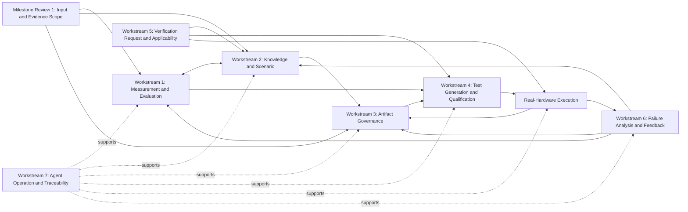

# Purpose and Status

This framework integrates the eleven reviewed work items into one outcome-oriented first delivery horizon. It is not yet a weekly schedule, staffing plan, or final Agent architecture. TF members must review the proposed Workstream boundaries, Milestone Review Evidence, and unresolved scope before this page becomes stable.

Coverage dimensions, formulas, and the total verification space remain deliberately undefined until the verification experts approve them.

# Framework Terminology

- **Workstream:** A continuous body of related work with an accountable owner, deliverables, dependencies, and completion Evidence. Workstreams run in parallel and do not imply one Agent or one Git repository each.
- **Milestone Review:** A review point where accountable experts examine Evidence and decide whether a bounded outcome is accepted, accepted with recorded conditions, or returned for revision.

These terms are written in full throughout the framework. PROVE Milestone Reviews organize this two-month plan and do not replace the company's WS or ES development Gates.

# Planning Window

- TF start: 2026-07-30
- Progress reporting: approximately weekly
- First internal demonstration target: 2026-08-27
- First integrated outcome target: around 2026-09-30
- Formal TF duration: adjustable after review of the plan and Evidence

These are planning targets. Milestone Review Evidence, not elapsed time alone, determines readiness.

# Two-Month Outcome

PROVE must demonstrate one operational, traceable vertical slice:

```text
Versioned Verification Request
→ versioned Spec, Legacy Package, or FLAIR Source
→ meaningful Requirement
→ Source Scenario Candidate and Canonical Scenario
→ Coverage-guided Test Case
→ validated Test Version
→ applicable Execution Plan
→ real SSD Hardware execution
→ Test Verdict and Evidence
→ Failure Analysis Agent when failed
→ Device / Non-device / Unknown Disposition
→ repair, recovery, BRAIN-ready handoff, or human escalation
```

Every object, transformation, Agent Run, execution, Evidence item, and decision must be traceable in both directions. The result must be usable with real project assets; a document-only method or disconnected prototype is insufficient.

# Mandatory Input, Output, and Review Contract

Every internal stage and Workstream must explicitly declare:

```text
Versioned Inputs
→ processing activity and producer Run
→ versioned Output
→ Output Review using declared criteria and Evidence
→ versioned Review Record
→ eligible Output becomes the next stage's Input
```

- Every durable Output is registered under [Artifact Lifecycle and Governance](/governance/generated-artifact-governance.md).
- Review is performed on the Output and its supporting Evidence, not on activity completion alone.
- A Review Record states the reviewer, criteria Version, Evidence, decision, conditions, uncertainty, and downstream eligibility.
- Revision creates a new Output Version; it never overwrites the reviewed Version.
- Experimental Outputs may feed an explicitly experimental path. They must not silently feed official Coverage, verdict, Package, or Baseline claims.
- Conditional acceptance may feed only downstream uses explicitly permitted by its Review Record. The universal conditional-use policy cannot yet be decided.
- Raw events and raw Evidence receive integrity and completeness checks when semantic acceptance is not applicable.
- If an Output has no downstream consumer or Review purpose, its necessity must be challenged.

Each Workstream section below names its current Inputs, Outputs, and Output Review. Exact schemas, thresholds, and authorities that were not established in the leader discussion are marked as not yet decidable.

# Workstreams

Coverage and evaluation research begins in parallel from the start. For durable verification assets, the ordered priority is explicit: extract high-quality Test Scenarios, establish Governance for those Scenarios and every later artifact, and only then expand downstream Test generation. A minimum identity and provenance rule still applies to Sources and Requirements before Scenario extraction.

## Workstream 1 — Measurement and Evaluation Foundation

**Purpose:** Define how PROVE knows that Requirements, Scenarios, Cases, Coverage, and Failure decisions are useful.

**Owns:** Evaluation contracts, Verification Space construction method, Coverage computation candidates, Golden Datasets, and regression evaluation. Workstream 1 evaluates other Workstreams but does not own their production implementation.

**Inputs:** Milestone Review 1 Input Manifest; versioned Requirement, Scenario, Case, execution, and Failure samples; Legacy Package Baselines; expert-authored examples; candidate Coverage methods; and the exact Agent, Model, Prompt, Knowledge, and Tool Versions being compared.

**Key work:**

1. Facilitate verification-expert workshops to define how a bounded verification space is constructed for the selected scope.
2. Define separate evaluation questions for Requirement extraction, Scenario intent, Test Case implementation, Oracle quality, execution Evidence, and Failure Disposition.
3. Curate stage-specific expert examples and end-to-end golden threads.
4. Build a repeatable Harness that reruns the same Dataset when an Agent, Prompt, Model, Knowledge version, or Tool changes.
5. Compare Legacy and generated assets for preserved, lost, redundant, and newly added verification capability.
6. Version every candidate metric and expose assumptions, limitations, and unexplained Gaps.

**Outputs:**

- Operational Coverage system for the selected scope
- Expert-agreed method for constructing and explaining the verification space
- Gap identification and Scenario-derivation guidance
- Stage-specific Golden Datasets plus representative end-to-end golden threads
- Evaluation Harness that can compare Agent, Prompt, Model, and Knowledge changes
- Separate Evidence for Verification Intent preservation and defect-detection preservation

The framework requires these capabilities but does not predefine their axes, weights, formulas, or acceptance thresholds.

**Output Review:** Verification experts review the proposed denominator and exclusions, evaluation criteria, rerun receipts, uncertainty, and Gap explanations. The versioned Review Record and accepted method become Inputs to Scenario derivation, Case selection and qualification, Failure evaluation, and later Milestone Reviews.

**Cannot yet be decided:** Coverage axes, denominator, formulas, weights, official thresholds, Golden Dataset size, Failure evaluation size, and final reviewers cannot yet be decided. They require Milestone Review 1 scope and expert work for Milestone Review 2.

**Completion Evidence:** The Harness runs on the Milestone Review 1 inputs, produces explainable results and Gaps, distinguishes Intent from defect-detection Evidence, and can be rerun after a controlled Agent or Knowledge change. Milestone Review 2 records expert acceptance, conditions, and rejected alternatives.

## Workstream 2 — Knowledge, Requirement, and Scenario

**Purpose:** Build PROVE's most important long-term asset: high-quality, traceable Test Scenarios and the Knowledge needed to derive them.

**Owns:** Source ingestion and identity, Requirement meaning, Verification Knowledge extraction, Scenario Candidates, Canonical Scenarios and Variants, and downstream Change Impact.

**Inputs:** Milestone Review 1 Input Manifest; exact Spec Versions; FLAIR FW and SoC revisions; four Legacy Package commits with their Libraries; relevant IceT code paths; user or engineer Knowledge; Verification Request context; Coverage and evaluation guidance; and the minimum artifact identity and provenance rules.

**Key work:**

1. Register exact Spec, FLAIR, Legacy Package, Library, and Knowledge versions without modifying the original Sources.
2. Define and evaluate a practical Requirement unit that preserves conditions, exceptions, expected behavior, and verification meaning.
3. Extract Scenarios and reusable Verification Knowledge from Specification and FLAIR inputs.
4. Analyze each Legacy Test with only the Test, Library, and IceT paths needed to explain intent, state, Oracle, applicability, Evidence, and recovery.
5. Preserve Source Scenario Candidates, then map them non-destructively to Canonical Scenarios or Variants.
6. Record duplicate, extension, conflict, Legacy-only, Spec-only, and unresolved relationships.
7. Traverse Traceability when a Source changes and identify Requirements, Scenarios, Cases, executions, and claims requiring reevaluation.

**Outputs:**

- Common semantic relationship model from Source through Requirement, Scenario Candidate, Canonical Scenario, and Variant, with governed downstream link points for Cases
- Practical Requirement extraction from selected official, OCP, customer, or internal Specifications
- Requirement and Scenario extraction from selected FLAIR FW and SoC context
- Scenario and Verification Knowledge extraction from the August 2026 Baselines of all four Legacy Test Packages
- Legacy code and Library analysis limited to paths needed to explain Scenario intent, state, Oracle, recovery, applicability, and Evidence
- Non-destructive Scenario canonicalization with explicit equivalent, extension, variant, conflict, and unresolved relationships
- Source and Version tracking with Change Impact Analysis
- Candidate State Contracts, semantic dependencies, and sequence relationships when Source Evidence supports them

Running extraction against all four Baselines is the target. The quantity that must receive expert attestation before the final two-month Milestone Review remains a scope decision; full manual review of every Legacy Test is not assumed.

**Output Review:** The Evaluation Harness and verification experts review Source fidelity, Requirement meaning, Scenario Verification Intent, applicable state and sequence meaning, provenance completeness, and explicit conflicts or uncertainty. The Review Record determines which Outputs may enter Workstream 3 Governance and then serve Workstreams 1, 4, and 5.

**Cannot yet be decided:** Requirement granularity, Scenario schema, Canonical catalog structure, equality and Variant rules, merge and split criteria, conflict authority, State Contract schema, and expert sample size cannot yet be decided.

**Completion Evidence:** All four Package Baselines enter the extraction pipeline; the expert-selected sample can be traced back to exact code and Source paths; Source, Candidate, Canonical, Variant, and conflict relationships are navigable in both directions; and a controlled Source change produces an explainable impact set.

## Workstream 3 — Artifact Lifecycle, Governance, and Shared Operation

**Purpose:** Govern every Scenario and later PROVE artifact before downstream generation expands, while allowing many teams to contribute without creating independent PROVE instances or unreviewed Global truth.

**Owns:** The mandatory Input–Output–Review contract, artifact identity and Version, Review Records, lifecycle and Trust, the common logical Knowledge plane, multi-team context, promotion authority, experimental-use boundary, conflict visibility, Revocation, and impact-driven correction.

**Inputs:** Every durable Source and Workstream Output; provenance, owner, producer Run, context, Evidence, and existing Review; team R&R; scope and Trust proposals; conflict or change requests; and promotion, deprecation, or Revocation requests.

**Key work:**

1. Define the minimum governance envelope applied to Scenario, Coverage, Case, Script, Execution Plan, Run, Evidence, verdict, Failure, and manifest artifacts.
2. Require every stage to declare versioned Inputs, immutable Output Versions, Review criteria, Review Evidence, and downstream consumers.
3. Accept inputs from multiple teams while preserving Source, owner, team, product, customer, Main/Deri, project, and version context.
4. Provide Team and Project Views over shared identities rather than authoritative copies.
5. Manage Knowledge Applicability Scope independently from Trust State.
6. Allow explicitly experimental Draft use while isolating it from official Coverage, verdict, Package, and Baseline claims.
7. Separate artifact production from validation and prevent an Agent from self-promoting its output.
8. Route final initial promotion to the accountable expert for the target scope.
9. Preserve conflicting artifacts or interpretations until an authorized resolution is recorded.
10. Revoke incorrect versions, calculate affected downstream assets, create corrected versions, and require re-review without rewriting history.

**Outputs:**

- Artifact Lifecycle and Governance contract
- Minimum Governed Artifact and Review Record requirements
- One common logical Knowledge and Traceability plane
- Context-aware Team and Project Views without authoritative copies
- Independent Knowledge Applicability Scope and Trust State
- Explicit experimental use of Draft artifacts, isolated from official claims
- Independent production and verification; no Agent self-promotion
- Initial final promotion by the accountable expert for the target scope
- Version-preserving Revocation, downstream impact analysis, correction, and revalidation
- Working View, Package Manifest, Run Manifest, and company WS/ES Gate Baseline reference and impact rules

The exact schema, storage implementation, universal lifecycle, Review authority, and conditional-acceptance policy cannot yet be decided. They require verification-team experts and operational Evidence.

**Output Review:** The applicable independent evaluator and scope owner review identity completeness, Input lineage, Evidence, producer–verifier separation, lifecycle decision, conditional-use limits, and downstream impact. The Review Record determines whether an artifact remains experimental or becomes eligible as a downstream Input. Exact authority remains unresolved.

**Cannot yet be decided:** Common physical schema, storage technology, identifier format, artifact-specific lifecycles, approval roles and quorum, automated versus human boundaries, conditional official use, retention, notification, and emergency Revocation policy cannot yet be decided.

**Completion Evidence:** Scenario Outputs and every later artifact in the Milestone Review 3 scope have stable identities, Versions, Input lineage, Review Records, status, and downstream references; the selected team/project contexts use shared identities; and the selected Revocation evaluation identifies downstream impact without deleting historical Baselines or Runs. The required context and Revocation sample counts cannot yet be decided and are set in Milestone Review 1.

## Workstream 4 — Test Case Generation and Qualification

**Purpose:** Generate concrete Cases that fill Scenario-defined verification space and prove that they are meaningful and executable.

**Owns:** Scenario-to-Case generation, Test Script production, Test qualification, Test Version identity, and the Evidence required before a Manifest adopts a Test.

**Inputs:** Reviewed Scenario and Verification Intent; accepted Coverage Gap and generation guidance; applicable Verification Knowledge and Patterns; required State Contract and sequence conditions; Verification Request context; IceT execution-contract Version; applicable Hardware and environment conditions; and the current Test qualification contract.

**Key work:**

1. Select concrete states, paths, conditions, and parameters from the Scenario-defined verification space.
2. Generate the executable Test Script and its Oracle against the chosen IceT execution contract.
3. Validate Syntax, Build, API use, and unsupported operations before Hardware execution.
4. Compare generated behavior with the Scenario intent and expected state flow.
5. Execute on real Hardware and observe Timeout, Crash, Flaky behavior, cleanup or preserved state, and recovery.
6. Separate a Test defect from an IceT Platform Failure; IceT loss of control makes execution Evidence insufficient rather than proving poor Test generation.
7. Create a new immutable Test Version after modification and attach new Validation Evidence.

**Outputs:**

- Scenario-to-Test Case generation for the selected HIL slice
- Executable qualification: Syntax, Build, supported API, and contract validation
- Scenario-intent fidelity and Oracle-adequacy Evidence
- Real-Hardware operational Evidence, including Timeout, Crash, Flaky, state preservation or cleanup, and recovery
- IceT control retention as a Platform invariant through Reset, Error, and abnormal Device state
- Minimal Test lifecycle: stable ID, immutable Version, Draft/Validated/Deprecated status, and Validation Evidence
- Official adoption through exact Package or Gate Baseline Manifest references

Test Script language, IceT shape, and Agent framework remain replaceable implementation decisions.

**Output Review:** Executable qualification, Scenario-intent fidelity, Oracle capability, real-Hardware operation, state behavior, repeatability, and IceT Platform control are reviewed separately. An independent Review Record links the accepted Evidence to the exact Test Version; eligible Versions may become Inputs to Package or successor Gate Baseline Manifest review.

**Cannot yet be decided:** Test language, final IceT contract, execution repetition count, Flaky threshold, Oracle sufficiency threshold, minimum Evidence for `Validated`, equivalent-variation sampling, and official-promotion authority cannot yet be decided.

**Completion Evidence:** Selected Cases build and execute on confirmed Hardware, their Scenario intent and Oracle are independently evaluated, repeated runs and state behavior are recorded, IceT retains control, and the exact validated Version can be referenced by a Package or successor Baseline Manifest.

## Workstream 5 — Verification Request, Applicability, and Execution

**Purpose:** Translate the user's verification Requirements into valid Tests and a feasible real-environment plan.

**Owns:** Verification Request normalization, context resolution, team-owned selection, Applicability, environment resolution, and Execution Plan construction. The initial Hardware resource is already confirmed; Workstream 5 records and uses it rather than selecting or procuring it.

**Inputs:** Raw user or approved upstream request; project, Main/Deri, customer, product, Spec, FW, time, and team context; team R&R; reviewed Requirement, Scenario, and Case catalogs; Coverage guidance; confirmed Hardware inventory and capability information; Platform Versions; and applicable Working View or Baseline references.

**Key work:**

1. Normalize natural language, Spec selection, configuration, or upstream-system input into a versioned Verification Request.
2. Preserve which values were requested, derived, defaulted, conflicting, or unresolved.
3. Resolve the applicable project, Main/Deri, product, customer, Spec version, team R&R, time budget, and verification goal.
4. Select relevant Requirements, Scenarios, and Test Cases without silently reducing requested scope.
5. Apply each team's candidate-selection decision separately from technical environment Applicability.
6. Record the confirmed Hardware inventory, Capability, configuration, availability, and current Platform version.
7. Match selected Cases to feasible systems and emit either a complete Execution Plan or explicit unmet conditions.
8. Keep engineer-local execution compatible with the future SkyTower execution contract.

**Outputs:**

- Versioned Verification Request as the top-level trace unit
- Mapping from request context to applicable Sources, Requirements, Scenarios, and Cases
- Team-owned Test candidate selection according to R&R, product, purpose, time budget, Hardware, and Tool constraints
- Environment and Capability information sufficient to produce an Execution Plan
- Explicit handling of requested, derived, defaulted, conflicting, and unmet conditions without silent substitution
- Common execution contract usable from engineer systems and compatible with later SkyTower scale-out
- Run Manifest, state and sequence lineage, Test Execution Run, raw Evidence references, and explicit unmet-condition report

Detailed team R&R is maintained separately and completed by experts from SWE, cSSD verification, eSSD verification, and FTE.

**Output Review:** The requester or authorized team role and automated checks review preserved intent, inclusion and exclusion rationale, defaults, unresolved values, team selection authority, technical Applicability, state and sequence compatibility, and execution readiness. The reviewed Execution Plan becomes the Input to Hardware execution; Run Outputs feed Workstreams 1, 4, 6, and 7.

**Cannot yet be decided:** Verification Request schema, allowed defaults, Capability taxonomy, Environment Registry schema, team-specific selection and approval R&R, SkyTower common contract, scheduling policy, and exact Hardware metadata schema cannot yet be decided. Hardware availability itself is confirmed.

**Completion Evidence:** A real Verification Request resolves into an explainable Test selection and runnable plan on the confirmed Hardware; every inclusion, exclusion, default, and unmet condition is traceable; and the same contract can be submitted from an engineer environment without creating a separate PROVE knowledge universe.

## Workstream 6 — Failure Analysis and Feedback

**Purpose:** Separate observed Test Fail from its responsible domain and close recoverable Non-device loops.

**Owns:** Failure Analysis Agent behavior, first-Failure Evidence, reproduction and diagnostics, Failure Analysis Records, Disposition, repair or recovery routing, Unknown escalation, and the BRAIN-facing package.

**Inputs:** Failed Test Execution Run and immutable first-Failure Evidence; Verification Request, Scenario, Case, Script, Oracle, State Contract, sequence lineage, environment, Host, IceT, DUT, and FW Versions; diagnostic Knowledge and Tools; Failure evaluation examples; and the current BRAIN contract draft.

**Key work:**

1. Trigger the PROVE Failure Analysis Agent from a Test Fail while keeping Test Verdict and Failure Disposition separate.
2. Freeze first-Failure Evidence before Reset, recovery, rerun, or repair changes state.
3. Build an adaptive reproduction and diagnostic plan; record skipped, failed, and stopped attempts.
4. Evaluate direct Device Evidence and reasonable exclusion of Test, IceT, Host, environment, and configuration causes.
5. Preserve `Unknown` when an external cause is unobservable rather than reasonably excluded.
6. Repair and revalidate a Test problem or recover an environment problem, then rerun through a new linked Attempt.
7. Package Device Disposition, Evidence, reproduction, and remaining uncertainty for BRAIN.
8. If BRAIN feedback is available, feed reclassification and Non-device corrections back into the same Failure lineage and evaluation Dataset; otherwise preserve a feedback-ready contract.

**Outputs:**

- Separate Test Verdict and Device/Non-device/Unknown Failure Disposition states
- Automatic PROVE Failure Analysis Agent trigger on Test Fail
- Immutable first-Failure Evidence before intervention
- Adaptive reproduction and diagnostic planning
- Stable Failure Analysis Record spanning attempts, hypotheses, repair or recovery, reruns, and feedback
- Device Disposition using direct Evidence or reasonable exclusion of Non-device causes
- Non-device Test repair or environment recovery followed by validation and rerun
- Unknown preservation and human escalation when Evidence is insufficient
- Versioned BRAIN Handoff Package definition
- Sequence-dependent Failure reproduction and minimized causal-sequence Evidence when applicable
- Feedback Knowledge, Scenario, Case, or environment-correction Candidates

Automatic BRAIN transfer and analysis start are a Stretch Outcome dependent on the external BRAIN team. PROVE's own Device/Non-device/Unknown Disposition remains mandatory.

**Output Review:** Review verifies first-Evidence preservation, Verdict and Disposition separation, reproduction rationale, State and sequence lineage, reasonable exclusion versus unobservability, continued use of Unknown, repair or recovery Traceability, rerun Evidence, and BRAIN package completeness. Accepted feedback Candidates return through Workstreams 1, 2, 3, or 4 rather than bypass Governance.

**Cannot yet be decided:** Disposition sufficiency criteria, accuracy target, Dataset size, Confidence representation, retry and recovery limits, responsible owner, human-escalation threshold, BRAIN API and schema, and required count of repair or recovery demonstrations cannot yet be decided.

**Completion Evidence:** Representative Failures create complete Records, preserve the first observation, produce an explainable Disposition or Unknown, demonstrate the selected repair or recovery rerun scope, and generate a versioned BRAIN-ready package. Required case counts and accuracy thresholds cannot yet be decided and are set through Milestone Reviews 1 and 4.

## Workstream 7 — Agent Operation, Traceability, and Reproducibility

**Purpose:** Make every Agent decision explainable, recoverable, comparable, and auditable.

**Owns:** Agent Run identity, event and Handoff recording, Artifact lineage, Checkpoints, Retry and resume, observability, audit reconstruction, replay, and result-equivalence evaluation support.

**Inputs:** Versioned Verification Request; reviewed artifact Versions and contracts; Agent, Prompt, Model, Knowledge, Source, Tool, and environment Versions; dependency graph; and current Checkpoint, Retry, cancellation, escalation, cost, and retention policies where defined.

**Key work:**

1. Create separate identities for Verification Request, Agent Workflow Run, Test Execution Run, and Failure Analysis Record.
2. Record Agent, Prompt, Model, Knowledge, Source, Tool, Artifact, configuration, cost, duration, and exit reason.
3. Exchange versioned Artifacts and Evidence at Handoff boundaries rather than relying only on conversational context.
4. Create durable Checkpoints at meaningful Artifact boundaries.
5. Resume through a new linked Attempt only after verifying upstream inputs and Checkpoint validity.
6. Invalidate downstream work when a Source or upstream Artifact changes.
7. Bound Retry and record its cause, policy, result, and escalation.
8. Support audit reconstruction, replay when pinned dependencies remain available, and verification-result equivalence for non-identical LLM outputs.

**Outputs:**

- Verification Request, Agent Workflow Run, Test Execution Run, and Failure Analysis Record identities
- Versioned Agent, Prompt, Model, Knowledge, Tool, Artifact, and Handoff records
- Versioned Artifact-based Handoffs and durable Checkpoints
- Linked new Attempts for Retry, resume, regeneration, and re-execution
- Upstream-change invalidation of affected downstream work
- Bounded Retry, explicit exit and escalation, cost and elapsed-time observation
- Audit reconstruction, operational replay, and verification-result equivalence

The number and names of Agents are derived from these capabilities after their input, output, evaluation, retry, and authority contracts are clear.

**Output Review:** Automated integrity checks and an independent audit review verify that the Workflow can be reconstructed, Artifact Handoffs are complete, Checkpoints remain valid, Retry and resume create new Attempts, upstream changes invalidate downstream work, and unavailable dependencies or substitutions are visible. Review packages feed Milestone Reviews 3 and 5.

**Cannot yet be decided:** Agent count and boundaries, orchestration framework, event schema, storage system, Checkpoint granularity, Retry and timeout limits, cost targets, retention, and verification-result equivalence criteria cannot yet be decided.

**Completion Evidence:** The vertical-slice scope selected in Milestone Review 1 can be reconstructed from the Verification Request through every Agent and Hardware Run; the selected interruption and upstream-change evaluations demonstrate linked resume and invalidation behavior; and unavailable dependencies or substitutions are reported explicitly. Required path and evaluation counts cannot yet be decided.

# Work-Item Mapping

| Reviewed item | Primary Workstream | Cross-cutting dependency |
|---|---|---|
| 1. Common Verification Knowledge Model | Workstream 2 | Workstreams 1, 3, and 7 |
| 2. Golden Dataset and Evaluation Harness | Workstream 1 | All Workstreams |
| 3. Source, Version, and Change Impact | Workstream 2 | Workstreams 3 and 7 |
| 4. Legacy Scenario and Knowledge Analysis | Workstream 2 | Workstreams 1 and 3 |
| 5. Requirement–Scenario Integration and Conflict | Workstream 2 | Workstreams 1 and 3 |
| 6. Execution Feasibility and Qualification | Workstream 4 | Workstreams 1, 3, and 5 |
| 7. Verification Request and Applicability | Workstream 5 | Workstreams 2, 3, 4, and 7 |
| 8. Failure Analysis and Disposition | Workstream 6 | Workstreams 1, 3, 4, 5, and 7 |
| 9. Knowledge Extension and Governance | Workstream 3 | Workstreams 2 and 7 |
| 10. Agent Operation and Reproducibility | Workstream 7 | All Workstreams |
| 11. Test Version and Official Adoption | Workstream 4 | Workstreams 3, 5, and 7 |

# Dependency and Feedback Flow



Work proceeds in parallel. Coverage experiments, Source Baselines, Golden Dataset curation, the Traceability skeleton, IceT execution contracts, and Failure examples can start together. Outputs remain experimental until the applicable Milestone Review accepts their criteria.

# Milestone Reviews

## Milestone Review 1 — Input and Evidence Scope

**Purpose:** Freeze the smallest credible input and evaluation scope against which the TF will make two-month claims. Milestone Review 1 does not select Hardware; the initial Hardware is already confirmed.

**Review inputs:**

- First one or two Specification types and exact versions
- No more than ten initial HIL Features and the reason each exposes useful AI-generated Test value
- Exact August 2026 commits for the four Legacy Package Baselines
- FLAIR FW or SoC sample context and exact revision
- Expert-authored Requirement, Scenario, Case, and end-to-end evaluation examples
- Representative Device, Test, IceT, Host/environment, and Unknown Failure examples
- Named verification-team representatives and accountable Workstream owners
- Source access, customer-Spec LLM policy, and known data limitations
- Inventory and Capability record for the already confirmed Hardware and execution systems

**Review questions:**

1. Is the slice small enough for two months but meaningful enough to demonstrate PROVE's core value?
2. Can Coverage, extraction, generation, execution, and Failure analysis all be evaluated on these inputs?
3. Are the Sources immutable and accessible, and are missing labels or relationships explicit?
4. Does every required Workstream have an owner, reviewer, and usable Evidence source?

**Exit decision:** Approve one versioned Milestone Review 1 Input Manifest. Unresolved limitations remain in the Manifest with an owner and effect; they are not silently assumed away.

**Review Output and downstream use:** A versioned Input Manifest and Review Record containing selected and excluded inputs, rationale, owners, reviewers, constraints, unresolved items, and affected Workstreams. This Output becomes the controlling Input for Workstreams 1 through 7 and Milestone Reviews 2 through 5.

**Cannot yet be decided:** Exact Spec and Feature selection, Legacy commits, FLAIR sample, Dataset and path counts, Workstream owners, reviewers, and detailed Hardware metadata schema cannot yet be decided before this Review. Hardware selection itself is already confirmed and is not reviewed here.

## Milestone Review 2 — Coverage Method Approval

**Working target:** Within the first two weeks. The exact calendar date cannot yet be decided until TF scheduling and Milestone Review 1 scope are complete.

**Purpose:** Accept a working Coverage and evaluation method that can guide Scenario and Case work. Milestone Review 2 does not declare a permanent universal Coverage formula.

**Review inputs:**

- Versioned definition of the selected verification space and its boundaries
- Candidate Coverage dimensions and computation with assumptions
- Golden Dataset and Evaluation Harness results
- Mapping of current Legacy Scenarios and Tests into the proposed space
- Preserved, lost, redundant, new, and unresolved capability report
- Example Gaps and the Scenario derivation decisions they trigger
- Separate Verification Intent and defect-detection Evidence

**Review questions:**

1. Can experts understand what the denominator means and what is excluded?
2. Can the same input and computation be rerun and audited?
3. Does the method expose Gaps rather than reward Test count or superficial similarity?
4. Can it compare Legacy and generated assets without making Legacy the upper bound?
5. Are uncertainty and disagreements visible?

**Exit Evidence:** The system accepts real Requirements and Legacy assets, constructs and explains the proposed verification space, maps current Scenario/Test assets, calculates experimental Coverage, exposes Gaps, and guides Scenario derivation. Verification experts approve the method for the selected scope; verification leaders and executives can understand the result and limitations.

**Exit decision:** Accept, conditionally accept with recorded limitations, or return the method for revision. Only accepted versions may serve as the current Milestone Review 3 generation guide.

Milestone Review 2 approves a working method, not an eternal universal formula. Later Evidence may revise it through versioned governance.

**Review Output and downstream use:** A versioned Coverage Method Review Record, accepted Evaluation Contract and method Version for the selected scope, assumptions and limitations, Gap Report, and Scenario derivation guidance. Accepted Outputs become Inputs to Workstreams 1, 2, 4, and 6 and to Milestone Reviews 3 through 5.

**Cannot yet be decided:** Coverage axes, denominator, formulas, weights, official thresholds, and long-term validity cannot yet be decided before expert work and Evidence in this Review.

## Milestone Review 3 — Thin End-to-End Demonstration

**Planning target:** 2026-08-27.

**Purpose:** Prove that the separate Workstream outputs operate as one usable chain on real assets and confirmed Hardware.

**Review inputs:**

- Versioned Verification Request and Milestone Review 1 input references
- Extracted Requirement and Source Scenario Candidate
- Canonical Scenario or Variant mapping and Verification Intent
- Coverage-guided Test Case and generated Test Script
- Static, Build, API, Scenario-intent, and Oracle validation results
- Applicable Execution Plan on confirmed Hardware
- Test Execution Run, Expected/Actual Evidence, and Coverage update
- Complete Agent and Artifact Traceability

**Review questions:**

1. Can a reviewer navigate from the user request to every generated and executed Artifact and back?
2. Does the Test implement the Scenario rather than merely compile?
3. Is the verdict supported by sufficient Evidence?
4. Did IceT retain control through every exercised Reset, Error, or abnormal state?
5. Can the Workflow be replayed or equivalently reevaluated?

**Exit Evidence:** The path set selected in Milestone Review 1 connects Verification Request, Source, Requirement, Scenario, Case, validated Test Version, real-Hardware Run, Expected/Actual Evidence, and Coverage result. IceT retains control. The exact path count, Feature count, and Spec choice cannot yet be decided and are resolved at Milestone Review 1.

**Exit decision:** Accept the vertical slice for expansion, conditionally accept it with named Gaps, or return affected Workstreams for revision. Passing Milestone Review 3 does not make every generated Test official.

**Review Output and downstream use:** A versioned Vertical Slice Review Package containing every reviewed Artifact Version, Review Record, Traceability and replay package, accepted and rejected claims, Gaps, conditions, and required revisions. It becomes Input to Workstream expansion, Milestone Review 4, and the final integrated review.

**Cannot yet be decided:** Required path count, Feature count, repetition and Flaky thresholds, minimum `Validated` Evidence, and which conditional Outputs may enter later official use cannot yet be decided before Milestone Reviews 1 and 2.

## Milestone Review 4 — Failure Disposition Readiness

**Purpose:** Demonstrate that PROVE can turn a Test Fail into an evidence-based responsible-domain decision and close recoverable Non-device loops.

**Review inputs:**

- Representative Failure Dataset selected at Milestone Review 1
- Initial failed Test Execution Runs and immutable first-Failure Evidence
- Failure Analysis Agent version, Tools, Knowledge, hypotheses, and diagnostic actions
- Reproduction attempts, omissions, stopping conditions, and results
- Device, Non-device, and Unknown decision rationale
- Test repair or environment recovery, validation, and rerun Evidence
- Versioned BRAIN Handoff Package and feedback contract draft

**Review questions:**

1. Is Test Fail clearly separated from Failure Disposition?
2. Was the first Failure state preserved before intervention?
3. Were Non-device causes reasonably excluded rather than merely unobservable?
4. Does Unknown remain available when Evidence is insufficient?
5. Can every automated action, correction, and reclassification be audited and reversed through versions?

**Exit Evidence:** The Failure set selected in Milestone Review 1 creates immutable Failure Analysis Records; the Agent preserves first Evidence, performs adaptive analysis, and produces explainable Device, Non-device, or Unknown Dispositions. The selected Test repair or environment recovery scope is rerun. The BRAIN Handoff Package is defined even if live integration is unavailable. Required Failure and rerun counts cannot yet be decided.

**Exit decision:** Accept PROVE Disposition for the selected evaluation scope, restrict it to narrower cases with recorded conditions, or require additional Evidence and revision. Live BRAIN integration remains a separate Stretch decision.

**Review Output and downstream use:** A versioned Failure Disposition Readiness Review Record containing the evaluated Failure set, method and Agent Versions, accuracy and uncertainty results, permitted automation scope, Unknown conditions, repair or recovery results, BRAIN Handoff Package draft, limitations, and required follow-up. It becomes Input to Workstreams 1, 2, 3, 4, and the final integrated review.

**Cannot yet be decided:** Required Failure count, accuracy threshold, Evidence sufficiency, Confidence representation, Retry and recovery limits, human-escalation rules, and live BRAIN readiness cannot yet be decided before representative Dataset and external-team review.

## Milestone Review 5 — Two-Month Integrated Outcome

**Planning target:** Around 2026-09-30.

**Purpose:** Decide whether the first PROVE result is strong enough to guide Firenze adoption and the next four-month horizon.

**Review inputs:**

- Milestone Reviews 1 through 4 decisions, conditions, and unresolved Gaps
- Integrated Traceability report across Requests, Sources, Knowledge, Scenarios, Cases, Runs, Failures, and manifests
- Coverage and evaluation results with versioned method and limitations
- Four-Package extraction progress and expert-attested quality sample
- Generated and validated Test Versions with real-Hardware Evidence
- Failure Disposition evaluation and Non-device feedback examples
- Agent reproducibility, cost, duration, Retry, and operational reliability report
- Artifact Lifecycle and Governance, promotion, Revocation, and impact-analysis example
- Current Working View, Package Manifest proposal, Run Manifests, and any affected company WS/ES Gate Baseline references
- Proposed Firenze scope, coexistence with Legacy Tests, and next risks

**Review questions:**

1. Has PROVE demonstrated broader or better measurable verification capability rather than only tool integration?
2. Which claims are supported, experimental, conditional, or still unknown?
3. What Legacy intent was preserved, missed, duplicated, or expanded?
4. Is the generated Test and Failure workflow reliable enough for the proposed Firenze usage?
5. Which Workstream must continue, change, or stop in the next horizon?

**Exit Evidence:** The required vertical slice operates as one traceable system across selected real inputs and confirmed Hardware. Results can be reproduced or equivalently reevaluated, and the TF can identify measured capability, preserved Legacy intent, observed Gaps, limitations, and the next Firenze adoption scope.

**Exit decision:** Record a bounded Firenze adoption recommendation and next-horizon proposal, recommend them with conditions, or retain PROVE as experimental until named Gaps close. Formal Firenze adoption approval follows the authorized company process, whose owner cannot yet be decided from the current discussion.

**Review Output and downstream use:** A versioned Two-Month Outcome Report and Review Record separating demonstrated, experimental, conditional, rejected, and unresolved claims; a proposed Firenze scope; remaining risks; required official approvals; and the next-horizon Input Manifest proposal. These Outputs become Inputs to the company adoption process and four-month planning.

A PROVE Milestone Review does not itself create, move, or approve a company WS/ES Gate Baseline. Any Baseline action follows the authorized development-Gate process and creates an immutable successor manifest when correction is required.

**Cannot yet be decided:** Formal Firenze approval authority, final adoption scope, four- and six-month outcomes, long-term success thresholds, production rollout commitment, and official Package migration pace cannot yet be decided from the current Evidence.

# Cannot Yet Be Decided

The following items were not established by the leader discussion or available Evidence. They must not be treated as facts or silently resolved by an Agent.

| Topic | Why it cannot yet be decided | Required input or review |
|---|---|---|
| Coverage space, axes, denominator, formula, weights, and thresholds | Verification experts have not approved a model | Workstream 1 Evidence and Milestone Review 2 |
| Initial Spec Versions, Features, and exact vertical-slice path count | Candidate scope has not been selected | Milestone Review 1 |
| Exact four-Package Baseline commits and expert-attested sample size | Package revisions and evaluation capacity are not recorded | Package owners and Milestone Review 1 |
| Golden Dataset and Failure Dataset size | Representative cases have not been curated | Workstreams 1 and 6, Milestone Review 1 |
| Requirement unit and Scenario schema | Practical extraction experiments and expert comparison are incomplete | Workstreams 1 and 2 |
| Canonical Scenario identity, equivalence, Variant, merge, split, and conflict authority | Several Source contexts and team policies must be compared | Workstreams 2 and 3 |
| State Contract schema and hidden sequence-dependency extraction rule | Current Legacy state dependency is unmanaged and partially observable | Workstreams 2, 4, 5, and 6 |
| Artifact schema, identifier format, storage, lifecycle, Review authority, quorum, and retention | Artifact types and multi-team operating rules are not yet evaluated | Workstream 3 and team experts |
| Conditional Review eligibility for official downstream use | Artifact-specific risk and owner policy are undefined | Workstream 3 and applicable scope owners |
| Test language, final IceT contract, Test repetition, Flaky, Oracle, Sampling, and `Validated` criteria | Runtime and evaluation Evidence are incomplete | Workstreams 1 and 4, Milestone Review 3 |
| Verification Request schema, default authority, Capability taxonomy, and Environment Registry schema | User and team workflows are not yet modeled | Workstream 5 and team R&R experts |
| Exact Hardware metadata schema and engineer-system allocation | Hardware is confirmed, but registration and allocation details are not recorded | Workstream 5; Hardware selection is not reopened |
| Team-specific Test selection, approval, and official verdict R&R | Each verification team must supply and review its own R&R | Verification-team R&R review |
| Failure Evidence sufficiency, accuracy, Confidence, retry, recovery, and Unknown thresholds | Representative evaluation data and policy are missing | Workstreams 1 and 6, Milestone Review 4 |
| BRAIN API, Handoff schema, readiness, and returned-feedback behavior | External BRAIN owner agreement is pending | BRAIN interface review; live integration is Stretch |
| FLAIR production input and feedback contracts | Only the conceptual input path is known | FLAIR interface review |
| Agent count, names, boundaries, orchestration framework, event schema, Checkpoints, Retry, cost, and equivalence criteria | Agent architecture must follow evaluated capability contracts | Workstream 7 after Workstream contracts stabilize |
| Customer-Spec commercial LLM transmission policy | NDA discussion is still in progress | Customer-Spec legal or policy approval |
| Formal Firenze approval owner and scope | Current framework can recommend but does not own the company approval process | Milestone Review 5 and authorized company process |
| Four- and six-month outcomes | Only the two-month horizon has been reviewed in detail | Milestone Review 5 and next-horizon planning |

New unknowns discovered during execution are added here and to [Open Questions](/open-questions/open-questions.md) with the Evidence and decision forum needed to resolve them.

# Required Versus Deferred Scope

## Required in the Two-Month Outcome

- Selected common HIL/NVMe scope shared by eSSD and cSSD
- Operational Coverage and evaluation path
- Spec and FLAIR Requirement/Scenario input paths for selected examples
- Legacy extraction across the four Package Baselines with expert-evaluated representative quality
- Scenario and Test Case generation with real-Hardware execution
- Full Traceability and reproducible Agent operation for the selected vertical slice
- PROVE Device/Non-device/Unknown Failure Disposition
- Minimum common-plane, Artifact Governance, and Test-version controls needed by the slice

## Stretch

- Live automatic PROVE-to-BRAIN transfer and automatic BRAIN Agent analysis
- Broader Feature or Package quality-attestation scope than Milestone Review 1 requires

## Deferred Beyond This Horizon

- Complete FLAIR–PROVE–BRAIN firmware repair closed loop
- Forced physical merge or completed migration of all Legacy Test Packages
- Full production validation of every Legacy Test and historical project
- Full FTL and Security Feature expansion
- All customer Specifications and all Main/Deri combinations
- Final global Workspace, permission, promotion, and conflict policy
- Full 5,000–8,000-device Mass rollout and optimization
- Permanent commitment to C++, a specific IceT design, LangGraph, or another Agent framework

# Program Controls

- Weekly reports are organized by Milestone Review Evidence, measured outcomes, decisions, risks, and blocked dependencies rather than Agent implementation activity.
- Each Workstream requires one accountable owner; assignments remain open.
- Verification-team R&R is maintained outside this framework and supplied by each team's expert.
- Every proposed metric or Coverage claim is labeled experimental until the applicable expert Milestone Review accepts it.
- Agent architecture follows this framework; the Workstream count does not imply an equal number of Agents.

# Immediate TF Decisions

1. Confirm this framework's Workstream and Milestone Review structure.
2. Complete Milestone Review 1 input selection and assign accountable owners.
3. Convene the Coverage and evaluation expert group for Milestone Review 2.
4. Select the first vertical slice and define Milestone Review 3 Evidence.
5. Confirm representative Failure examples and external BRAIN availability for Milestone Review 4.
